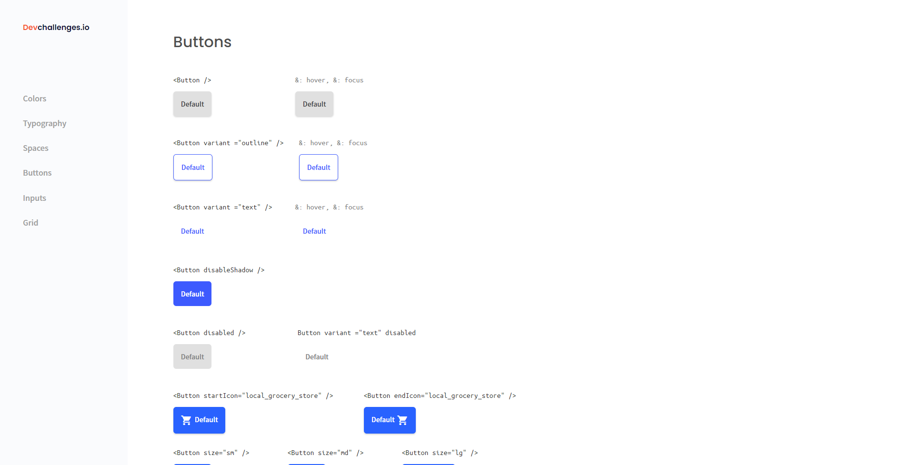

<h1 align="center">Button Component</h1>

   Solution for a challenge from  <a href="http://devchallenges.io" target="_blank">Devchallenges.io</a>.

  <h3>
    <a href="https://button-component-fvcano.netlify.app/">
      Demo
    </a>
     | 
    <a href="https://github.com/FV-Cano/devChallenges/tree/main/Front-end/button-component-master">
      Solution
    </a>
     | 
    <a href="https://devchallenges.io/challenges/ohgVTyJCbm5OZyTB2gNY">
      Challenge
    </a>
  </h3>

<!-- TABLE OF CONTENTS -->

## Table of Contents

- [Table of Contents](#table-of-contents)
- [Overview](#overview)
  - [Built With](#built-with)
- [Features](#features)
- [Acknowledgements](#acknowledgements)
- [Contact](#contact)

<!-- OVERVIEW -->

## Overview

This is the first project I've ever made with React. It was interesting learning how components work and also coding in TSX. It was for sure a better first contact with the framework than with Angular.

The project itself is nothing impressive; it's just a major practice for getting used to working with components. When I started this project, I decided that my path through React was going to be steep in matters of difficulty. First I was going to start with a project only focused on components like this one, then a more complicated project using React Hooks, then start using other libraries, etc. Yet after all this work, I realized that I spent plenty more time working with the CSS code of this project than with React, which is supposed to be the main focus of these front-end challenges.

That is why, after that sort of revelation, I decided not to struggle with the CSS code (that is why it's a bit clumsy), finish the project as soon as possible, and then start learning about what this framework really has to offer.

Overall, it was a great experience and a nice first glance at React. For the next project, I will try to use different libraries to help me with the front-end process to be able to stop using a lot of pure CSS code.

### Built With

<!-- This section should list any major frameworks that you built your project using. Here are a few examples.-->

- [React](https://es.reactjs.org/)
- [CSS](https://developer.mozilla.org/es/docs/Web/CSS)
- [TS](https://www.typescriptlang.org/)

## Features

<!-- List the features of your application or follow the template. Don't share the figma file here :) -->

This application/site was created as a submission to a [DevChallenges](https://devchallenges.io/challenges) challenge. The [challenge](https://devchallenges.io/challenges/ohgVTyJCbm5OZyTB2gNY) was to build an application to complete the given user stories.

## Acknowledgements

<!-- This section should list any articles or add-ons/plugins that helps you to complete the project. This is optional but it will help you in the future. For exmpale -->

- [Icons](https://developers.google.com/fonts/docs/material_icons?hl=es-419#using_the_icons_in_html)

## Contact

- LinkedIn [Federico Vicente Cano](https://www.linkedin.com/in/cano-federico/)
- GitHub [FV-Cano](https://github.com/FV-Cano)
