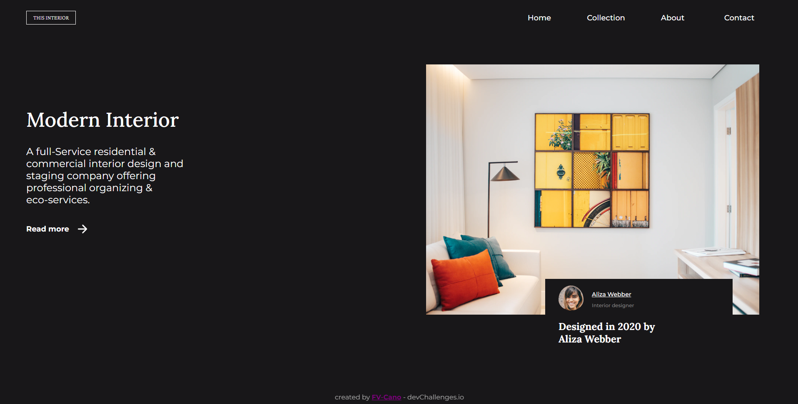

<h1 align="center">Interior Consultant</h1>

   Solution for a challenge from  <a href="http://devchallenges.io" target="_blank">Devchallenges.io</a>.

  <h3>
    <a href="https://interior-consultant-fvcano.netlify.app/">
      Demo
    </a>
     | 
    <a href="https://github.com/FV-Cano/devChallenges/tree/main/Responsive%20Web/3.%20interior-consultant-master">
      Solution
    </a>
     | 
    <a href="https://devchallenges.io/challenges/Jymh2b2FyebRTUljkNcb">
      Challenge
    </a>
  </h3>

<!-- TABLE OF CONTENTS -->

## Table of Contents

- [Table of Contents](#table-of-contents)
- [Overview](#overview)
  - [Built With](#built-with)
- [Features](#features)
- [Acknowledgements](#acknowledgements)
- [Contact](#contact)

<!-- OVERVIEW -->

## Overview

This project was a bit more challenging than the previous ones, but I can certainly feel some improvement. As I backtrack through the challenge, I can see clearly that certain tasks were easier than they used to be. For instance, my coding speed improved and the ‘visualization’ of the whole website with its containers and proper objects became far easier than before. In my first project, I didn’t know how to start or even where to start. Now, I can picture a first sketch in my head, something that greatly quickens the process.

However, this project also had its challenges. One of the biggest was probably the creation of the burger menu. This is something that can be easily achieved using basic design frameworks such as Bootstrap or Tailwind. But since the challenge was to design the website with pure CSS and pure HTML, I had to 'reinvent' the wheel.

While this was not particularly a problem, it took plenty of time to build these features and implement them. Moreover, whenever I finish a challenge and start with the next one, the difficulty increases; and that increase can be seen without effort.

So far, this 3-project journey helped me understand what happens behind a framework and have a better understanding of CSS, HTML and JS. Yet, at least for a while, I will stop doing these challenges.

Now, with the knowledge gained from this experience, I want to test myself and see if I can learn how to use a framework and start doing front-end challenges.

### Built With

<!-- This section should list any major frameworks that you built your project using. Here are a few examples.-->

- [HTML](https://developer.mozilla.org/es/docs/Web/HTML)
- [CSS](https://developer.mozilla.org/es/docs/Web/CSS)
- [JS](https://developer.mozilla.org/es/docs/Web/JavaScript)

## Features

<!-- List the features of your application or follow the template. Don't share the figma file here :) -->

This application/site was created as a submission to a [DevChallenges](https://devchallenges.io/challenges) challenge. The [challenge](https://devchallenges.io/challenges/Jymh2b2FyebRTUljkNcb) was to build an application to complete the given user stories.

## Acknowledgements

<!-- This section should list any articles or add-ons/plugins that helps you to complete the project. This is optional but it will help you in the future. For exmpale -->

- [Script for detecting Mobile Browsers](https://caniuse.com/matchmedia) (Not used)
- [StackOverflow Post](https://stackoverflow.com/questions/3514784/how-to-detect-a-mobile-device-using-jquery/24600597#24600597)
- [Icon library](https://ionic.io/ionicons)

## Contact

- LinkedIn [Federico Vicente Cano](https://www.linkedin.com/in/cano-federico/)
- GitHub [FV-Cano](https://github.com/FV-Cano)
