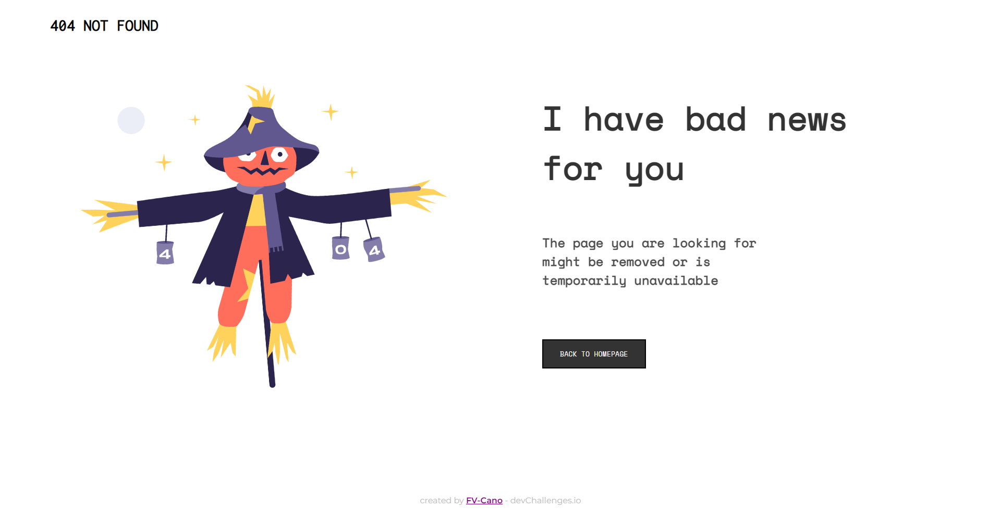

<h1 align="center">404-not-found</h1>

   Solution for a challenge from  <a href="http://devchallenges.io" target="_blank">Devchallenges.io</a>.

  <h3>
    <a href="https://404-not-found-fvcano.netlify.app/">
      Demo
    </a>
     | 
    <a href="https://github.com/FV-Cano/devChallenges/tree/main/Responsive%20Web/404-not-found-master">
      Solution
    </a>
     | 
    <a href="https://devchallenges.io/challenges/wBunSb7FPrIepJZAg0sY">
      Challenge
    </a>
  </h3>

<!-- TABLE OF CONTENTS -->

## Table of Contents

- [Table of Contents](#table-of-contents)
- [Overview](#overview)
  - [Built With](#built-with)
- [Features](#features)
- [Acknowledgements](#acknowledgements)
- [Contact](#contact)

<!-- OVERVIEW -->

## Overview

Hello! Thanks for taking some time to look at this project, you can check out the demo of my project by clicking on the 'Demo' link below the project name. This is the second project I've ever done using HTML and CSS. The first project I tried doing was a portfolio using Angular, but honestly it was something really hard considering I had never tried doing something like that at that time. That is when I figured out that I had to keep learning and practising from the very basics. To whoever is looking at this, thanks for joining me on this journey!
Throughout this project, I got a better understanding of how transitions work as well as some knowledge about CSS, which sometimes can be a bit difficult to handle.

### Built With

- [HTML](https://developer.mozilla.org/es/docs/Web/HTML)
- [CSS](https://developer.mozilla.org/es/docs/Web/CSS)

No major frameworks were used to build this project.

## Features

This application/site was created as a submission to a [DevChallenges](https://devchallenges.io/challenges) challenge. The [challenge](https://devchallenges.io/challenges/wBunSb7FPrIepJZAg0sY) was to build an application to complete the given user stories.

## Acknowledgements

## Contact

- LinkedIn [Federico Vicente Cano](https://www.linkedin.com/in/cano-federico/)
- GitHub [FV-Cano](https://github.com/FV-Cano)
