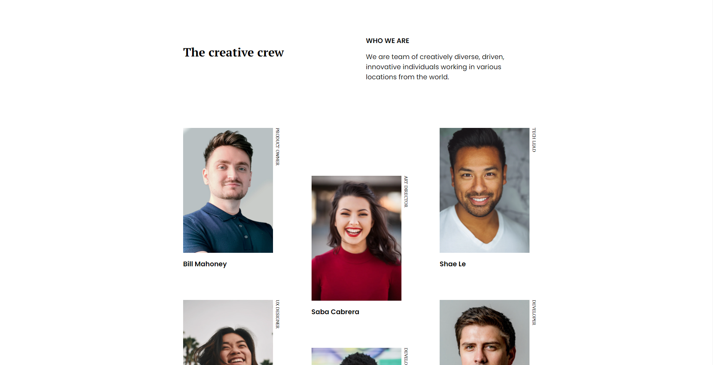

<h1 align="center">My team page</h1>

   Solution for a challenge from  <a href="http://devchallenges.io" target="_blank">Devchallenges.io</a>.

  <h3>
    <a href="https://my-team-page-fvcano.netlify.app/">
      Demo
    </a>
     | 
    <a href="https://github.com/FV-Cano/devChallenges/tree/main/Responsive%20Web/my-team-page-master">
      Solution
    </a>
     | 
    <a href="https://devchallenges.io/challenges/hhmesazsqgKXrTkYkt0U">
      Challenge
    </a>
  </h3>

<!-- TABLE OF CONTENTS -->

## Table of Contents

- [Table of Contents](#table-of-contents)
- [Overview](#overview)
  - [Built With](#built-with)
- [Features](#features)
- [Acknowledgements](#acknowledgements)
- [Contact](#contact)

<!-- OVERVIEW -->

## Overview

Hello again! this project was a bit more difficult. I especially struggled with rotated text and learning how to use flexbox. There's still room for improvement of course, feel free to give feedback. You can see the demo of the project by clicking on the 'Demo' link below the project name.

### Built With

- [HTML](https://developer.mozilla.org/es/docs/Web/HTML)
- [CSS](https://developer.mozilla.org/es/docs/Web/CSS)

No major frameworks were used to build this project.

## Features

This application/site was created as a submission to a [DevChallenges](https://devchallenges.io/challenges) challenge. The [challenge](https://devchallenges.io/challenges/hhmesazsqgKXrTkYkt0U) was to build an application to complete the given user stories.

## Acknowledgements

## Contact

- LinkedIn [Federico Vicente Cano](https://www.linkedin.com/in/cano-federico/)
- GitHub [FV-Cano](https://github.com/FV-Cano)
